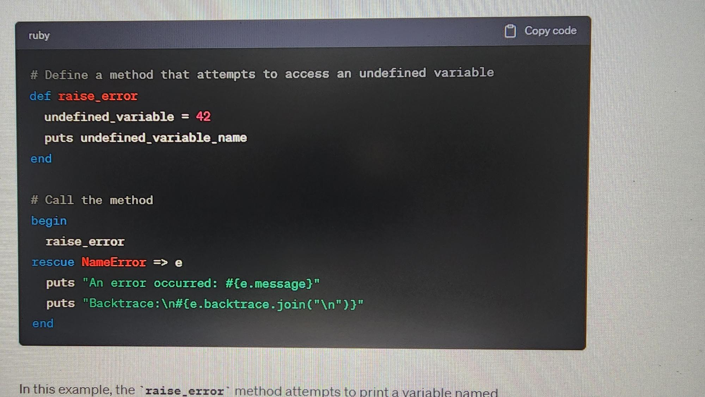
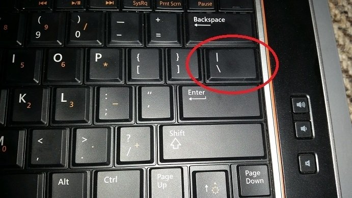

# Writing Good Documentation

## Step 1 - Using Codeblocks

Codeblocks in markdown make it *very easy* for tech people to **copy, paste, share** code.
A good __Cloud Engineer__ uses Codeblocks whenever possible.

Because it allows others to copy and paste their code to replicate or research issues.

- In order to create codeblocks in Markdown, you need to use three backticks (`)
- Not to be confused with quotation (')

```
#  Calculates the factorial of a given number using a recursive function
def factorial(n)
  if n <= 1
    return 1
  else
    return n * factorial(n - 1)
  end
end

# Example usage:
number = 5
result = factorial(number)
puts "The factorial of #{number} is #{result}."
```

- when you can, you should attempt to apply syntax highlighting to your codeblocks

```ruby
#  Calculates the factorial of a given number using a recursive function
def factorial(n)
  if n <= 1
    return 1
  else
    return n * factorial(n - 1)
  end
end

# Example usage:
number = 5
result = factorial(number)
puts "The factorial of #{number} is #{result}."
```

- Make note of where the backtick keyboard key is located.
- It should appear above the tab key.
- But it may vary based on your keyboard layout.


Good Cloud Engineers use codeblocks for both Code and Errors that appear in the console.


```bash
# Define a method that attempts to access an undefined variable
def raise_error
  undefined_variable = 42
  puts undefined_variable_name
end

# Call the method
begin
  raise_error
rescue NameError => e
  puts "An error occurred: #{e.message}"
  puts "Backtrace:\n#{e.backtrace.join("\n")}"
end
```
> Here is an example of using a codeblock for an error that appears in bash.

## Step 2 - How to take screenshots

A screenshot is when you capture a part of your screen from your laptop, desktop or phone.

This is not to be confused with taking a photo with your phone.



## Step 3 - Use GitHub Flavored Markdown Task Lists

GitHub extends Markdown to have a list where you can check off items. [<sup>[1]</sup>](#external-references)

- [x] Finish Step 1
- [ ] Finish Step 2
- [x] Finish Step 3

## Step 4 Use Emojis (Optional)
GitHub Flavored Markdown (GFM) supports emoji shortcodes.
Here are some examples

You can use the following Markdown format to create tables
```md
| Name | Shortcode | Emoji |
| --- | --- | --|
| Cloud | `:cloud:` | :cloud |
| Cloud with lightning | `:cloud_with_lightning:` | :cloud_with_lightning |
```
GitHub extends the functionality of Markdown tables to provide more alignments and and table call formatting options.[<sup>[2]</sup>](#external-references)

- Make note of where the pipe keyboard key is located.
- It should appear above the return or enter key.
- But it may vary based on your keyboard layout.




## External References
- [GitHub Flavored Markdown Spec](https://github.github.com/gfm/)
- [Basic Writing and Formatting Syntax (GitHub Flavored Markdown Spec)](https://docs.github.com/en/get-started/writing-on-github/getting-started-with-writing-and-formatting-on-github/basic-writing-and-formatting-syntax)
- [GFM - Tasks Lists](https://docs.github.com/en/get-started/writing-on-github/getting-started-with-writing-and-formatting-on-github/basic-writing-and-formatting-syntax) <sup>[1]</sup>
- [GFM - Emoji Cheat Sheet](https://github.com/ikatyang/emoji-cheat-sheet)
- [GFM - Tables (with extensions)](https://github.github.com/gfm/#tables-extension-) <sup>[2]</sup>
  
