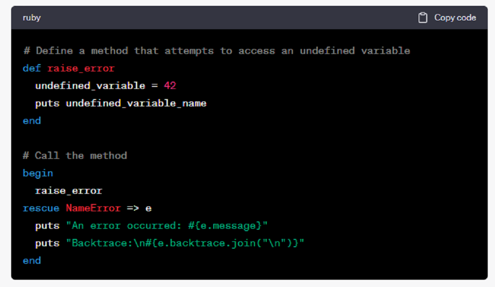

# Writing Good Documentation

## Step 1 - Using Codeblocks

Codeblocks in markdown make it *very easy* for tech people to **copy, paste, share** code.
A good __Cloud Engineer__ uses Codeblocks whenever possible.

Because it allows others to copy and paste their code to replicate or research issues.

- In order to create codeblocks in Markdown, you need to use three backticks (`)
- Not to be confused with quotation (')

```
#  Calculates the factorial of a given number using a recursive function
def factorial(n)
  if n <= 1
    return 1
  else
    return n * factorial(n - 1)
  end
end

# Example usage:
number = 5
result = factorial(number)
puts "The factorial of #{number} is #{result}."
```

- when you can, you should attempt to apply syntax highlighting to your codeblocks

```ruby
#  Calculates the factorial of a given number using a recursive function
def factorial(n)
  if n <= 1
    return 1
  else
    return n * factorial(n - 1)
  end
end

# Example usage:
number = 5
result = factorial(number)
puts "The factorial of #{number} is #{result}."
```

- Make note of where the backtick keyboard key is located.
- It should appear above the tab key.
- But it may vary based on your keyboard layout.


Good Cloud Engineers use codeblocks for both Code and Errors that appear in the console.


```bash
# Define a method that attempts to access an undefined variable
def raise_error
  undefined_variable = 42
  puts undefined_variable_name
end

# Call the method
begin
  raise_error
rescue NameError => e
  puts "An error occurred: #{e.message}"
  puts "Backtrace:\n#{e.backtrace.join("\n")}"
end
```
> Here is an example of using a codeblock for an error that appears in bash.

## Step 2 - How to take Screenshots

A screenshot is when you capture a part of your screen from your laptop, desktop or phone.

This is not to be confused with taking a photo with your phone.

**Don't Do This**


**This is what a screen shot from your computer should look like**

**Do This Instead**


Taking screenshots in Windows using hotkeys is a convenient way to capture your screen or specific windows quickly. Here's a step-by-step guide on how to use hotkeys to take screenshots in Windows:

1. **Full Screen Screenshot (Print Screen):**
   - Press the "PrtScn" (Print Screen) key on your keyboard. Depending on your keyboard layout, this key might be labeled differently, but it's usually located near the top right corner of the keyboard.
   - The screenshot is now copied to your clipboard.
   - To save the screenshot, open an image editing program like Paint, Photoshop, or Word, and paste the screenshot by pressing "Ctrl + V." You can then save the image in your desired format.

2. **Active Window Screenshot (Alt + Print Screen):**
   - Make sure the window you want to capture is active (in focus).
   - Press "Alt + PrtScn" keys simultaneously.
   - The screenshot of the active window is copied to your clipboard.
   - Open an image editing program and paste the screenshot using "Ctrl + V" to save or edit it.

3. **Partial Screen Screenshot (Windows Key + Shift + S):**
   - Press "Windows Key + Shift + S" together. This keyboard shortcut opens the Snipping Tool or Snip & Sketch tool, depending on your Windows version.
   - The screen will dim, and a crosshair cursor will appear.
   - Click and drag to select the area you want to capture.
   - The screenshot will be copied to your clipboard, and you can paste it into an image editing program or another application for further use.

4. **Screenshot of Active Window (Windows Key + Shift + S on Windows 10 and later):**
   - Press "Windows Key + Shift + S" together.
   - Choose the "Rectangular Snip" or "Freeform Snip" option.
   - Use the cursor to select the active window.
   - The screenshot will be copied to your clipboard, and you can paste it into an image editing program or another application.

5. **Screenshot of the Entire Screen (Windows Key + PrtScn on Windows 8 and 10):**
   - Press "Windows Key + PrtScn" simultaneously.
   - The screenshot will be saved as an image file in the "Screenshots" folder within your "Pictures" library.

6. **Screenshot of the Active Window (Windows Key + Alt + PrtScn on Windows 10 and later):**
   - Make sure the window you want to capture is active.
   - Press "Windows Key + Alt + PrtScn" simultaneously.
   - The screenshot of the active window will be saved as an image file in the "Screenshots" folder within your "Pictures" library.

These hotkeys provide various options for taking screenshots in Windows, depending on your specific needs. Choose the one that suits your purpose best and start capturing screenshots effortlessly.

## Step 3 - Use GitHub Flavored Markdown Task Lists

GitHub extends Markdown to have a list where you can check off items. [<sup>[1]</sup>](#external-references)

- [x] Finish Step 1
- [ ] Finish Step 2
- [x] Finish Step 3

## Step 4 Use Emojis (Optional)
GitHub Flavored Markdown (GFM) supports emoji shortcodes.
Here are some examples

You can use the following Markdown format to create tables
```md
| Name | Shortcode | Emoji |
| --- | --- | --- |
| Cloud | `:cloud:` | ☁️ |
| Cloud with lightning | `:cloud_with_lightning:` | 🌩️ |
```
GitHub extends the functionality of Markdown tables to provide more alignments and and table call formatting options.[<sup>[2]</sup>](#external-references)

- Make note of where the pipe keyboard key is located.
- It should appear above the return or enter key.
- But it may vary based on your keyboard layout.


## External References
- [GitHub Flavored Markdown Spec](https://github.github.com/gfm/)
- [Basic Writing and Formatting Syntax (GitHub Flavored Markdown Spec)](https://docs.github.com/en/get-started/writing-on-github/getting-started-with-writing-and-formatting-on-github/basic-writing-and-formatting-syntax)
- [GFM - Tasks Lists](https://docs.github.com/en/get-started/writing-on-github/getting-started-with-writing-and-formatting-on-github/basic-writing-and-formatting-syntax) <sup>[1]</sup>
- [GFM - Emoji Cheat Sheet](https://github.com/ikatyang/emoji-cheat-sheet)
- [GFM - Tables (with extensions)](https://github.github.com/gfm/#tables-extension-) <sup>[2]</sup>
  
